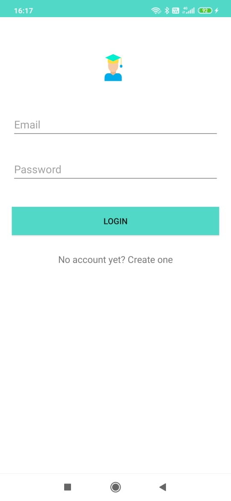
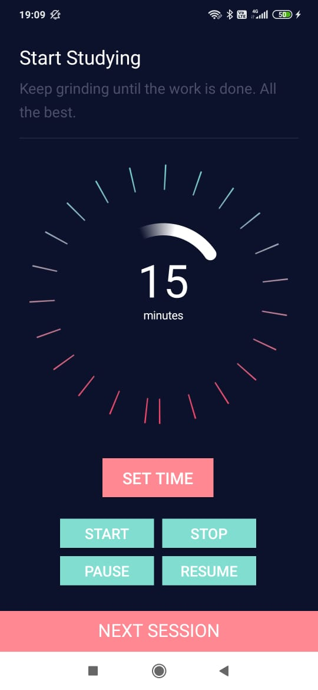
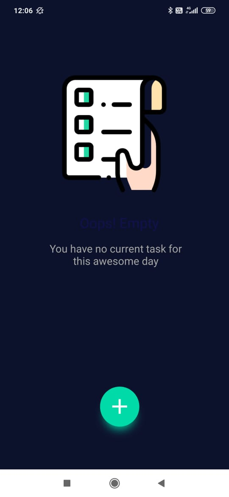

# Study Buddy App

Your buddy who will help you to study.

Onboarding Page                            |  Login Page                         |  Signup Page
:-----------------------------------------:|:-----------------------------------:|:-------------------------:
  |      | 

Dashboard                           |  Study Timer                        |  Task List
:----------------------------------:|:-----------------------------------:|:-------------------------:
        |       | 

## Features

### 1. Study Timer
-   Set the timer before studying and while studying don't leave the app for any other purpose.
-   If you are able to study the whole time without using the phone for any other purpose you'll score points
-   If you are unable to do so, you'll lose points.
-   Points will work as a reward-system which will keep you motivated to study without dostraction.
-   Thus, this feature will help you to tackle distractions

### 2. Task List
-   Use the task list feature to maintain your daily tasks.
-   This will help you stay organized.
